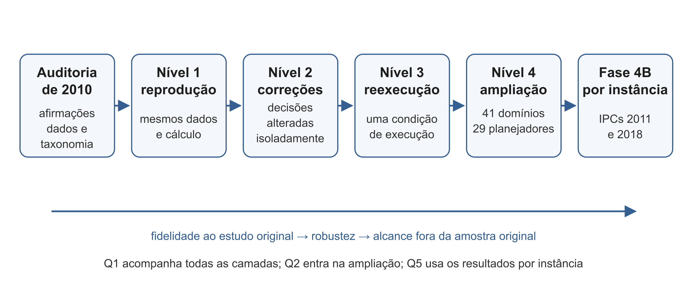

# Método

Este capítulo descreve como as perguntas Q1, Q2 e Q5 foram respondidas; os experimentos com modelos de linguagem (Q3) são descritos no capítulo 6, e a investigação exploratória sobre desenvolvimento de software (Q4), no capítulo 7. A revisão não repete o experimento de 2010 de uma só vez. Ela o refaz em camadas: primeiro reproduz o cálculo sobre os mesmos dados; depois altera decisões identificadas pela auditoria; em seguida reexecuta os planejadores sob uma condição comum; por fim amplia dados, planejadores e características. Nos Níveis 1 e 2, mudanças isoladas permitem localizar o efeito de decisões específicas. Nos Níveis 3 e 4 e na Fase 4B, várias condições mudam ao mesmo tempo; as comparações documentam a robustez e o alcance do resultado, sem constituir identificação causal de cada diferença.

Todas as análises são feitas por *scripts* versionados no repositório do projeto, com os dados e a configuração ao lado; cada experimento tem um registro próprio, identificado por um código EXP-nn, com o comando que o reproduz. O Apêndice B lista os registros.

## Visão geral

O primeiro quadro resume o desenho. As perguntas vêm do capítulo 1; os níveis de 1 a 4 são as camadas de replicação da Fase 3, e as IPCs de 2011 e 2018, a ampliação da Fase 4B.

::: quadro
| Camada | O que muda em relação a 2010 | Dados | Pergunta |
|---|---|---|---|
| Nível 1: reprodução | Nada: o método de 2010 recalculado por *script* | Tabelas publicadas em 2010 | Q1 |
| Nível 2: correções | Discretização, taxonomia de técnicas, contagens, rótulos, medida de validação | Tabelas publicadas em 2010 | Q1 |
| Nível 3: reexecução | Todas as notas medidas sob a mesma condição | 10 planejadores de 2010 nos 10 domínios de treino | Q1 |
| Nível 4: ampliação | Mais planejadores e domínios; características extraídas do PDDL | 29 planejadores × 41 domínios (Planner Museum) | Q1, Q2 |
| IPCs 2011 e 2018 | Dados de competição por instância; técnica pela taxonomia em quatro dimensões | 2 edições, 5 trilhas | Q5, Q1 |

: Camadas do método, dados e perguntas
:::

::: fonte
Fonte: Autor.
:::

O quadro identifica dados e perguntas; a figura seguinte destaca a progressão epistemológica do desenho, da fidelidade ao cálculo publicado à avaliação fora da amostra original.

{width=95%}

::: fonte
Fonte: Autor.
:::

## O experimento de 2010 como objeto de estudo

### Dados e fonte de verdade

O ponto de partida é o conjunto de dados da dissertação de 2010 [@haddad2010relacao]. As 44 tabelas foram extraídas do documento original, uma por arquivo, com a numeração das legendas, e convertidas em um conjunto de tabelas processáveis: os 13 domínios, os 10 planejadores, as 17 métricas, o valor e a classe de cada métrica em cada domínio, a eficiência e a nota de cada planejador em cada domínio de treino, as técnicas atribuídas a cada planejador e o *ranking* de validação. <!-- fonte: data/2010/README.md -->

A **fonte de verdade é o texto publicado**. O acervo de 2010 tem também um arquivo SQL com os dados, mas ele reúne blocos repetidos, uma versão anterior da atribuição de técnicas e um trecho truncado, e por isso serve só de conferência. A conferência entre as duas fontes deu 170 de 170 classes, 100 de 100 eficiências e 100 de 100 notas iguais; a atribuição de técnicas difere, porque o SQL guarda a versão anterior. O autor conferiu manualmente o conjunto de dados. <!-- fonte: data/2010/README.md, "Resultado da conferência" -->

Duas contagens publicadas foram corrigidas a partir das figuras da própria dissertação, com aprovação do autor: o número de associações do Pathways (de 4 para 2) e o número de generalizações do TPP (de 2 para 4). O valor publicado é preservado ao lado do corrigido, e toda análise diz qual dos dois usa. <!-- fonte: data/2010/correcoes_2010.csv; achados G11 e G12 -->

### Domínios, planejadores e características

Os 10 planejadores, os 10 domínios de treino e os 3 de validação são os de 2010, descritos no capítulo 3. Os problemas de cada domínio foram localizados, por comparação de conteúdo, nas coleções oficiais das IPCs de 1998 a 2008: 10 domínios têm todos os problemas idênticos aos da competição; o Gripper foi gerado localmente com o gerador oficial; e, em três domínios, o acervo usa só as primeiras instâncias do conjunto (35 de 102 no Blocks World, 28 de 84 no Logistics e 20 de 36 no Satellite), corte que, segundo o autor, buscou igualar o subconjunto dos resultados publicados. <!-- fonte: docs/benchmarks-ipc-ate-2008.md; achados G14 e G15 -->

As características de domínio de 2010 são 17 métricas contadas à mão nos diagramas UML.P do itSIMPLE [@vaquero2005itsimple; @tonidandel2006reading]: 3 do diagrama de casos de uso, 9 do diagrama de classes e 5 do diagrama de máquina de estados, apresentadas no quadro a seguir. <!-- fonte: data/2010/metricas.csv -->

::: quadro
| Diagrama | Métricas |
|---|---|
| Casos de uso | Número de atores; número de casos de uso; número de casos de uso por atores (rótulo invertido: os valores são atores por caso de uso) |
| Classes | Classes; atributos; métodos; associações; agregações; generalizações; hierarquias; DIT máximo; HAgg máximo |
| Máquina de estados | Estados; ações de entrada; ações de saída; ações; transições |

: As 17 métricas de 2010 por diagrama UML
:::

::: fonte
Fonte: Autor "adaptado de" Haddad, 2010.
:::

### Duas populações de dados

A eficiência de 2010 é a porcentagem de problemas resolvidos. Para cada par planejador × domínio, ela veio dos resultados de uma IPC, quando o planejador participou daquela edição com aquele domínio, ou de execução própria, em oito computadores Intel Core 2 Duo de 2,5 GHz com 4 GB de memória e Ubuntu 9.04, com limite de 20 minutos por problema. <!-- fonte: auditoria/condicoes-de-execucao-2010.md --> A dissertação atribui 38 pares à competição e 62 à execução própria, mas os registros de execução do acervo mostram que quatro valores apresentados como de competição (R e Fast Downward no Depots e no DriverLog) vieram de execução própria: são 34 e 66 (achado G21). As duas populações diferem em *hardware*, limite de tempo e versão dos planejadores, e o Nível 3 existe para eliminar essa mistura. <!-- fonte: auditoria/relatorio-auditoria.md, seção 10 -->

## Taxonomia de técnicas em quatro dimensões

### Por que refazer

A dissertação de 2010 atribuía a cada planejador um conjunto de rótulos (*State-Space*, *Plan-Space*, *Forward-chaining*, *Graph-based*, *SAT-based* e outros) e calculava a nota média de cada rótulo. A auditoria mostrou que esses rótulos misturam coisas diferentes: a direção da busca, o espaço em que ela ocorre, a ordem do plano produzido, o uso de heurística e a fonte do conhecimento; e que várias atribuições contrariam a descrição que os próprios autores fazem dos planejadores (capítulo 3). A revisão substitui os rótulos por uma taxonomia em quatro dimensões independentes, validada pelo orientador em 24/09/2026. <!-- fonte: auditoria/taxonomia-tecnicas.md; redacao/orientador/2026-09-24-retorno-m1.md -->

### As quatro dimensões

::: quadro
| Dimensão | Pergunta | Valores (exemplos) |
|---|---|---|
| D1 Algoritmo e espaço de busca | Como o planejador percorre ou constrói o espaço de soluções? | Busca progressiva no espaço de estados; decomposição recursiva por metas; busca no espaço de planos parciais; busca em grafo de planejamento; compilação para SAT; busca local; decomposição por subobjetivos; busca simbólica; busca por largura e novidade |
| D2 Heurística | Que informação guia a escolha do próximo passo? | Sem heurística; relaxação da remoção de efeitos; grafo causal; *landmarks*; abstrações; heurísticas aprendidas |
| D3 Representação | Como o problema é representado internamente? | STRIPS proposicional; grafo de planos; grafos de ação; SAT/CNF; variáveis multivaloradas (SAS+); representação simbólica (BDD); sem aterramento |
| D4 Arquitetura | O sistema é um planejador único ou combina vários? | Planejador único; planejador com componente plugável; decomposição com planejador base fixo; portfólio |

: As quatro dimensões da taxonomia de técnicas
:::

::: fonte
Fonte: Autor.
:::

Cada valor de cada dimensão é definido a partir da descrição do planejador na sua fonte primária. Assim, o FF passa a ser busca progressiva no espaço de estados (D1), com heurística de relaxação (D2), sobre representação STRIPS proposicional (D3), como planejador único (D4) [@hoffmann2001ff]; o Fast Downward, busca progressiva com a heurística do grafo causal sobre variáveis multivaloradas [@helmert2006fast]; o System R, decomposição recursiva por metas, sem heurística numérica [@lin2001planner]; o SATPlan, busca em grafo de planejamento seguida de compilação para SAT [@kautz2006satplan]. As atribuições dos 10 planejadores, com a fonte de cada uma, estão no Apêndice A. <!-- fonte: auditoria/taxonomia-tecnicas.md, seção 3; auditoria/taxonomia/planejadores_4d.csv -->

### Codificação dos planejadores

Três conjuntos de planejadores foram codificados, sempre a partir de fonte primária quando havia:

a) os **10 planejadores de 2010**, com cinco decisões de codificação (C1 a C5) aprovadas pelo autor; <!-- fonte: EXP-06 -->
b) os **29 planejadores do Planner Museum** [@lequen2026planner], dos quais 22 com fonte primária lida e 7 só com fonte secundária, identificados como tal; <!-- fonte: EXP-13 -->
c) as **78 codificações de planejador por trilha das IPCs de 2011 e 2018**, a partir dos resumos oficiais das competições. <!-- fonte: docs/fase4b-desenho.md, D1 -->

Os portfólios, que vencem trilhas das IPCs desde 2011 [@coles2012survey], exigem regra própria. A regra adotada (P1) atribui a D4 = portfólio e dá a D1, D2 e D3 a união dos valores dos componentes descritos na fonte. Para os casos ambíguos, em que a própria literatura reconhece não haver definição aceita de portfólio [@vallati2018what], a revisão considera portfólio o sistema que se descreve como tal ou que executa dois ou mais componentes completos em execuções separadas (em sequência, em paralelo ou por seleção por tarefa). Não é portfólio o planejador que faz uma única busca com várias heurísticas, como o LAMA [@richter2010lama], nem o que aciona uma segunda fase quando a primeira falha, como o FF. Toda análise que envolve técnicas é apresentada em dois recortes: com todos os planejadores e sem os portfólios. <!-- fonte: docs/fase4b-desenho.md, D1 -->

Os planejadores atuais pediram valores que os de 2010 não usam, como a busca por largura e novidade [@lipovetzky2017bestfirst], a busca simbólica [@torralba2017efficient], a relaxação parcial e a representação sem aterramento. Eles foram acrescentados às dimensões como valores novos, cada um com a sua fonte. A extensão aos modelos de linguagem é tratada no capítulo 6. <!-- fonte: EXP-13 (N1 a N6); docs/fase4b-desenho.md (N7) -->

## Reprodução e correções sobre os dados de 2010 (Níveis 1 e 2)

### Reprodução por *script*

O Nível 1 recalcula o método de 2010 inteiro a partir das tabelas publicadas, etapa por etapa: discretização das métricas em Alto, Médio e Baixo, conversão da eficiência em nota de 0 a 10, relação entre característica e técnica, relevância das características, *ranking* previsto e validação. Cada etapa é comparada, célula a célula, com a tabela correspondente da dissertação. Quando a regra aplicada em 2010 não estava escrita, as alternativas plausíveis foram testadas contra as tabelas, e a regra que as reproduz foi registrada como inferida. <!-- fonte: EXP-03 -->

### Correções e cenários

O Nível 2 mantém os dados de 2010 e muda uma decisão de cada vez, sempre comparando com a referência (o método de 2010 com a aritmética corrigida) e com uma linha de base sem características:

a) discretização pela regra descrita no texto de 2010, em vez da regra de extremos que as tabelas revelam; <!-- fonte: EXP-04 -->
b) taxonomia em quatro dimensões no lugar dos rótulos de 2010; <!-- fonte: EXP-06 -->
c) rótulo corrigido da métrica de atores por caso de uso, contagens corrigidas do Pathways e do TPP e contagem de classes com as classes auxiliares do itSIMPLE; <!-- fonte: EXP-08 -->
d) discretização recalculada com 18 domínios adicionais das IPCs de 1998 a 2008, para medir quanto a classe de um domínio depende da amostra; <!-- fonte: EXP-10 -->
e) medida de validação trocada, como descrito a seguir. <!-- fonte: EXP-09 -->

A **linha de base sem características** ordena os planejadores pela nota média nos 10 domínios de treino, a mesma para qualquer domínio novo. Se o método de 2010 não se sai melhor que ela, as características do domínio não demonstram ganho para essa decisão e para a função objetivo avaliada.

### Medidas de validação

A dissertação de 2010 validava o *ranking* pela coincidência exata de posição entre o *ranking* previsto e o observado nos domínios de validação. Essa medida depende de como os empates são desfeitos: no Zeno-travel e no Elevator, metade ou mais dos planejadores tem a nota máxima, e qualquer ordem entre eles é arbitrária. A revisão adota três medidas, reportadas sempre ao lado da linha de base: <!-- fonte: EXP-09; plano, seção 10 (26/09/2026) -->

a) **perda em relação ao *virtual best***, a medida principal: a diferença entre a nota do melhor planejador no domínio e a nota do planejador que o método põe em primeiro lugar. Ela mede o que importa para quem escolhe, isto é, quanto se perde por seguir a recomendação, e não depende de desempate;
b) **correlação de postos de Spearman** entre o *ranking* previsto e o observado, como medida secundária;
c) **acerto por posição**, só para comparar com os números de 2010.

## Reexecução dos planejadores de 2010 (Nível 3)

### Ambiente

O Nível 3 roda de novo os 10 planejadores de 2010 nos 10 domínios de treino, sob uma só condição, para que todas as notas venham da mesma população. Os binários são os do acervo de 2010, compilados para Linux de 32 bits. Um primeiro ambiente, uma máquina virtual Ubuntu 22.04 com emulação da arquitetura i386 no computador do autor, mostrou que os planejadores rodam e reproduzem os planos de 2010, mas de 4 a 8 vezes mais devagar que as máquinas de 2010, o que levaria a rodada a cerca de 17 dias. <!-- fonte: EXP-01; plano, seção 10 (25/09/2026) --> A rodada completa foi feita numa máquina virtual do Google Cloud (c2d-standard-8, com 4 núcleos físicos AMD EPYC 7B13 e Ubuntu 22.04), em que os binários de 32 bits rodam sem emulação, com quatro execuções em paralelo. As chamadas de cada planejador são as dos *scripts* finais de 2010, conferidas linha a linha (1.492 linhas). <!-- fonte: EXP-05 -->

### Limite de tempo calibrado

O limite de 2010 era de 20 minutos numa máquina de 2009. Para que o limite equivalha ao de 2010 no novo ambiente, cada planejador recebeu um limite calibrado: rodaram-se até seis problemas que ele resolveu em 2010 com tempo entre 2 e 300 segundos, e o fator de velocidade é a mediana da razão entre o tempo agora e o tempo registrado nos *logs* de 2010. O limite é 20 minutos vezes esse fator, arredondado para cima. O LPG-TD, que é estocástico, recebeu a mediana dos fatores dos planejadores determinísticos e rodou com três sementes. <!-- fonte: EXP-02 -->

::: quadro
| Planejador | Fator | Limite (min) |
|---|---|---|
| Blackbox | 0,47 | 10 |
| FF | 0,38 | 8 |
| Fast Downward | 0,50 | 10 |
| IPP | 0,33 | 7 |
| LPG-TD | 0,42 (mediana dos demais) | 9 |
| MAXPLAN | 0,62 | 13 |
| R | 0,42 | 9 |
| SATPlan | 0,37 | 8 |
| SGPlan | 0,38 | 8 |
| YAHSP | 0,42 | 9 |

: Fator de velocidade e limite calibrado por planejador no ambiente do Nível 3
:::

::: fonte
Fonte: Autor.
:::
<!-- fonte: experimentos/execucoes/fatores-2010-gcp.csv -->

Não houve limite de memória imposto: a máquina tinha 32 GB, e os binários de 32 bits param por volta de 4 GB. <!-- fonte: EXP-05 -->

### Instâncias e execuções

As instâncias são as mesmas da execução própria de 2010, com os subconjuntos do acervo e o Gripper gerado. Foram 3.390 execuções. Três desvios em relação a 2010 ficaram registrados como limitação: o R no Pathways não rodou, porque espera um arquivo de domínio que o acervo não tem para esse domínio (30 execuções a menos); o Satellite rodou com o arquivo de domínio da competição, e não com o de 2009 que o acervo indica ter sido usado em 2010; e o Blackbox no Satellite foi rodado também com a opção de memória que os *logs* de 2010 mostram, como variante (achados G25 e G26, adiante). <!-- fonte: EXP-05 -->

### Medidas

Do Nível 3 saem quatro medidas por planejador e domínio:

a) **cobertura**, a porcentagem de problemas resolvidos, convertida em nota de 0 a 10 pela regra de 2010, que o Nível 1 confirmou: a eficiência exata dividida por 10; <!-- fonte: EXP-03 (G6); EXP-19 -->
b) **qualidade do plano**, pelo número de ações, no formato do escore da IPC: em cada problema, o menor plano encontrado por qualquer planejador dividido pelo plano do planejador, e zero quando ele não resolve; os planos são considerados corretos, sem validação externa, por decisão do autor; <!-- fonte: EXP-20; plano, seção 10 (27/09/2026) -->
c) **tempo**, pelo mesmo escore aplicado ao tempo de relógio, com piso de 1 segundo, porque a maior parte dos planos sai em menos de 1 segundo e abaixo disso a diferença é de inicialização do processo; <!-- fonte: EXP-22 -->
d) **memória máxima** de cada execução, para separar as falhas de busca das falhas por falta de memória. <!-- fonte: EXP-22 -->

Com as notas de cobertura do Nível 3, o método de 2010 é aplicado de novo (EXP-19). Os domínios de validação não foram reexecutados, e o *ranking* observado de validação continua sendo o de 2010. <!-- fonte: EXP-19; plano, seção 10 (27/09/2026) -->

## Ampliação com resultados publicados (Nível 4)

O Nível 4 testa o método de 2010 e seletores atuais numa amostra maior, usando apenas resultados publicados. A fonte é o Planner Museum [@lequen2026planner], que reexecutou 29 planejadores das IPCs de 1998 a 2023 sob a mesma condição (30 minutos e 4 GiB por execução) nos 42 domínios da coleção Autoscale, com 30 instâncias cada, e publicou a cobertura por planejador e domínio. O Pathways ficou de fora, porque nenhum planejador resolve nenhuma instância dele; restam 41 domínios e 1.230 instâncias. A análise é por domínio e só com cobertura, porque o artefato não publica resultados por instância. <!-- fonte: EXP-12; plano, seção 10 (26/09/2026) -->

A tarefa é a de 2010: escolher um planejador para um domínio novo. A perda de um seletor num domínio é a cobertura do melhor planejador naquele domínio menos a do planejador escolhido.

## Características extraídas do PDDL

A revisão usa três famílias de características extraídas automaticamente dos arquivos PDDL, sem modelagem manual. Elas são calculadas sem acesso ao resultado dos competidores e, portanto, podem estar disponíveis antes da decisão do seletor. A terceira família inclui sondagem heurística e exige executar computação sobre estados da tarefa; não é uma leitura puramente estática do arquivo.

### Métricas de 2010 a partir do PDDL

O extrator das métricas de 2010 aplica regras fixadas antes de qualquer comparação com os valores publicados: a hierarquia de tipos dá as classes, as generalizações, as hierarquias e a profundidade de herança; as ações dão os casos de uso, os métodos e as ações; os predicados de aridade 0 ou 1 dão os atributos, e os de aridade 2 ou mais, as associações. Os atores são uma convenção fraca (os tipos distintos do primeiro parâmetro das ações), porque o PDDL não declara agentes. Das 17 métricas, 11 têm correspondente no PDDL; as outras seis (agregações, HAgg máximo, estados, ações de entrada, ações de saída e transições) são decisões de quem modela em UML.P e não têm equivalente no PDDL. <!-- fonte: EXP-07 -->

### *Features* SAS+

A segunda família descreve a estrutura da tarefa depois da tradução do PDDL para a representação por variáveis de domínio finito (SAS+), feita pelo tradutor do Fast Downward [@helmert2006fast]. São 16 *features*, escolhidas antes de rodar a partir das estruturas que a literatura liga à dificuldade das tarefas [@helmert2009concise; @hoffmann2011analyzing; @domshlak2013complexity]: <!-- fonte: EXP-11; experimentos/extratores/features-sas/instancias.csv -->

a) **tamanho**: número de variáveis, tamanho médio e máximo do domínio das variáveis, operadores, metas e axiomas;
b) **grafo causal**: arestas, densidade, grau máximo, aciclicidade, número de componentes fortemente conexas, fração das variáveis na maior componente e limite superior da largura em árvore;
c) **grafos de transição de domínio**: arcos por variável, fração de variáveis com grafo fortemente conexo e fração de arcos invertíveis, as duas últimas como aproximação da reversibilidade.

Por domínio, usa-se a mediana das instâncias. Nos 13 domínios de 2010, as *features* foram extraídas das 354 instâncias; no Autoscale, de uma amostra fixa de 10 instâncias por domínio, com 120 segundos por tradução. <!-- fonte: EXP-11; EXP-12 -->

### Topologia de busca

A terceira família, usada só na Fase 4B, mede propriedades da paisagem de busca na linha de @hoffmann2011analyzing: o resultado do critério estrutural de Hoffmann, a fração de transições invertíveis, o valor da heurística hFF no estado inicial e, por amostragem de 10 estados, a taxa de becos sem saída, a taxa de sucesso de uma sondagem e a profundidade média da saída. Antes do uso, o extrator foi validado contra os resultados publicados por @hoffmann2011analyzing, com correlação de postos de 0,966 na sondagem e 0,987 nos becos sem saída, em 30 domínios. Uma sétima medida, que usava o melhor custo conhecido de cada instância, foi descartada antes de qualquer resultado, porque esse custo vem dos planos dos competidores e um seletor não o teria na hora de escolher. <!-- fonte: EXP-25 -->

## Resultados das IPCs de 2011 e 2018 (Fase 4B)

### Fontes e validação

As IPCs posteriores a 2010 publicaram seus resultados em granularidades diferentes, e parte deles saiu do ar. Só duas edições têm resultados por instância acessíveis: a de 2018, cujos resultados por execução estão publicados (17.640 execuções nas trilhas ótima, *satisficing* e *agile*), e a de 2011, recuperada a partir de uma cópia do banco de dados da ferramenta WebPlan preservada no Software Heritage (560 problemas e 5.679 planos válidos, com custo e sem tempo, nas trilhas ótima e *satisficing*). As duas foram validadas contra os placares oficiais: a ordem oficial dos planejadores de 2011 é reproduzida nas duas trilhas, e as somas de cobertura, nota e erros de cada planejador de 2018 conferem com o relatório oficial. A edição de 2014 só publicou totais por trilha [@vallati2018what], e a de 2023, resultados por domínio em sete domínios; as duas entram só de forma descritiva. <!-- fonte: docs/resultados-ipc-2011-2023.md; data/ipc-2011-2023/README.md -->

### Recorte

As comparações são sempre **dentro de cada edição e trilha**, porque o *hardware*, os limites (30 minutos e 6 GB em 2011; 30 minutos, ou 5 na *agile*, e 8 GiB em 2018) e as métricas mudam de uma edição para outra. Em 2018, as duas formulações de caldera e de organic-synthesis entram como domínios separados. As tarefas que o tradutor não converte em 1.800 segundos, o limite da própria competição, ficam sem *features* e fora da análise, com a contagem registrada. <!-- fonte: docs/fase4b-desenho.md, D2 -->

### Famílias de técnica e modelos

Uma **família** é um valor da D1 ou da D2 da taxonomia; um planejador com vários valores entra em várias famílias, e a família resolve uma instância quando algum planejador dela a resolve. Três análises foram feitas, sempre com e sem portfólios: <!-- fonte: EXP-21 -->

a) **mapa família × domínio**: as instâncias resolvidas pelo melhor planejador de cada família e pelo melhor planejador geral, em cada domínio;
b) **previsão por instância** (Q5): para cada família, uma regressão logística e uma árvore de profundidade 2 preveem se ela resolve a instância a partir das características, com validação que deixa um domínio de fora por vez; a medida é a área sob a curva ROC (AUC) fora da amostra, comparada com a de um modelo só com o tamanho da tarefa. A significância vem de um teste de permutação do rótulo, com correção de Holm entre os modelos de cada recorte; para a topologia, um segundo teste permuta só o bloco de topologia, para medir o que ela acrescenta às *features* SAS+; <!-- fonte: EXP-21; EXP-25 -->
c) **seleção por instância** (R-29): os seletores descritos a seguir escolhem um planejador por instância, e a perda é 1 quando o escolhido não resolve. <!-- fonte: EXP-24 -->

As três análises usam unidades, referências e desfechos diferentes. Separá-las evita transformar capacidade de prever a resolução de uma família em evidência de que um seletor escolhe o melhor planejador.

| Análise | Unidade | Sinal disponível | Referência | Desfecho fora da amostra |
|---|---|---|---|---|
| Mapa família × domínio | Domínio dentro de edição e trilha | Resultados observados | Melhor planejador geral | Diferença de cobertura, descritiva |
| Predição de família | Instância elegível | Tamanho, SAS+ e, no experimento complementar, topologia | Modelo apenas com tamanho | AUC ao deixar um domínio de fora |
| Seleção R-29 | Instância elegível | Os mesmos blocos de características | SBS escolhido apenas no treino | Número de falhas ao deixar um domínio de fora |

: Unidade, sinal, referência e desfecho das análises da Q5

::: fonte
Fonte: Autor, com base nos desenhos de EXP-21, EXP-24 e EXP-25.
:::

Uma instância é elegível quando possui resultado de competição e o bloco de características exigido pelo modelo. A quantidade elegível pode, portanto, variar entre análises; os capítulos de resultados informam as exclusões. Em cada dobra, tanto o SBS quanto os parâmetros dos seletores são determinados sem usar o domínio mantido para teste. A decomposição posterior do bloco de topologia em sondagem e demais propriedades foi uma análise exploratória formulada após o resultado agregado e não recebeu uma nova família de correção por comparações múltiplas. <!-- fonte: EXP-21; EXP-24; EXP-25 -->

## Seletores, validação e testes

Os mesmos seletores são usados no Nível 4 (por domínio) e na Fase 4B (por instância), fixados antes de rodar:

a) **referências**: o *virtual best* (VBS), que escolhe sempre o melhor planejador e dá o limite superior; o *single best* (SBS), o planejador com maior cobertura no treino, usado para todo domínio novo; e a escolha ao acaso;
b) **o método de 2010**, com o planejador no lugar da técnica e a discretização pelos tercis do treino, porque a regra de extremos deixa quase tudo em Médio numa amostra grande; e o mesmo método **por técnica**, com a taxonomia em quatro dimensões, juntas ou uma de cada vez;
c) **k vizinhos mais próximos** (3 vizinhos por domínio, 5 por instância) e ***random forest*** de regressão com várias saídas (300 árvores, semente 2010). <!-- fonte: EXP-12; EXP-13; EXP-24 -->

A validação deixa um domínio de fora por vez: o seletor é treinado com os demais e testado no domínio que não viu, como na situação de 2010, em que o método recomendava planejadores para domínios novos. A comparação com o SBS usa o teste de Wilcoxon pareado sobre a perda por domínio. Como vários seletores são comparados com o mesmo SBS, os valores de p são corrigidos pelo método de Holm dentro de cada família de comparações. <!-- fonte: experimentos/analise/correcao_multipla.py -->

A distinção entre VBS e SBS, e a distância entre os dois como medida do ganho que a seleção pode trazer, segue a literatura de seleção de algoritmos [@kerschke2019automated]. Um seletor que não supera o SBS não demonstra ganho para a decisão fixa e a função objetivo avaliadas.

## Limitações

### Do experimento original

A reexecução revelou cinco pontos do experimento de 2010 que as tabelas publicadas não mostravam (achados G22 a G26): <!-- fonte: experimentos/relatorio-fase3.md, seção 5; auditoria/achados-fase0.md -->

a) **G22**: o Blackbox rodou sem limite de tempo no Depots e no DriverLog;
b) **G23**: a discretização aplicada foi pelos extremos (menor valor Baixo, maior Alto, o resto Médio), e não pela variância descrita no texto;
c) **G24**: o mesmo método usou duas atribuições de técnicas diferentes (o IPP dentro e fora de *Forward-chaining*);
d) **G25**: o Satellite rodou com outro arquivo de domínio, de 2009, com uma pré-condição a mais que o da competição, e o Blackbox usou nele uma opção de memória que não usou nos demais domínios;
e) **G26**: no TPP e no Pathways, 2010 usou versões aterradas dos domínios, e um dos binários do FF usados no TPP não está no acervo.

### Desta revisão

a) **A ordem do PDDL não foi controlada.** A literatura mostra que reordenar um modelo sem mudar seu significado altera o desempenho dos planejadores e os *rankings* [@vallati2021importance]. O controle previsto foi dispensado com o orientador: os planejadores de 2010 rodaram os arquivos das competições, e não PDDL exportado do itSIMPLE (exceto o Satellite, G25), e as métricas UML são contagens que a ordem não altera. Fica sem medida a robustez do *ranking* de 2010 a uma ordem arbitrária do PDDL. <!-- fonte: plano, seção 10 (27/09/2026) -->
b) **A validação de 2010 não foi reexecutada.** O *ranking* observado nos três domínios de validação é o publicado em 2010.
c) **O Nível 4 é por domínio e só por cobertura**, porque o Planner Museum não publica resultados por instância; a seleção por instância só é testada com os dados das IPCs de 2011 e 2018.
d) **Os planos do Nível 3 não foram validados** por um validador externo.
e) **Os resultados de competição são dados secundários.** Cada planejador roda uma vez por instância, com as instâncias escolhidas pela organização de cada edição; em 2014, as instâncias foram escolhidas pelos próprios competidores [@vallati2018what], e a seleção nas edições usadas aqui não foi auditada.
